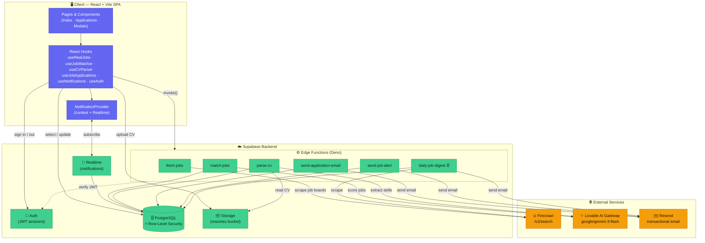
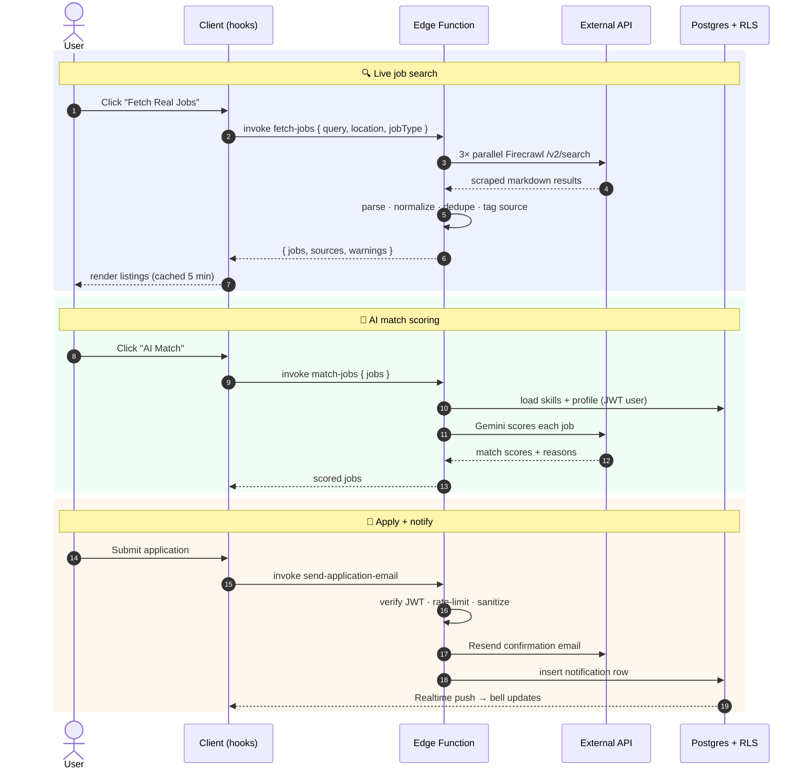
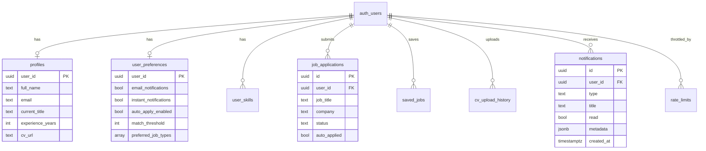

<div align="center">

# ⚡ JobFlow

### AI-powered job matching that finds, scores, and helps you apply — automatically.

Upload your CV once, set your preferences, and let AI surface the most relevant roles
from LinkedIn, Indeed, StepStone, HeyJobs, and Xing — with personalized match scores,
one-click applications, and real-time notifications.

<br/>


</div>

---

## ✨ Features

- 🔍 **Live multi-board job search** — parallel scraping across LinkedIn, Indeed, StepStone, HeyJobs & Xing via Firecrawl
- 🧠 **AI match scoring** — your CV, skills, and preferences scored against every job by Google Gemini (via Lovable AI Gateway)
- 📄 **CV parsing** — upload a PDF, auto-extract skills and profile fields
- 📬 **Email + in-app notifications** — application confirmations, job alerts, and a daily digest
- 🌍 **EU + US location filters** — country-by-country with major cities
- 🔐 **Secure by default** — JWT-verified edge functions, RLS on every table, per-user rate limiting, HTML/PII sanitization

---

## 🏗️ End-to-End Architecture



### How the core flows work



---

## 🧩 Tech Stack

| Layer | Technology |
|-------|-----------|
| **Frontend** | React 18, Vite 5, TypeScript 5 |
| **UI** | Tailwind CSS, shadcn/ui (Radix), Framer Motion, Lucide icons |
| **State / Data** | React Query, React Context, custom hooks |
| **Backend** | Supabase — Auth, PostgreSQL (RLS), Storage, Realtime, Edge Functions (Deno) |
| **AI** | Lovable AI Gateway → `google/gemini-3-flash-preview` |
| **Scraping** | Firecrawl `/v2/search` |
| **Email** | Resend |

---

## ⚙️ Edge Functions

| Function | Trigger | Purpose | External | Auth |
|----------|---------|---------|----------|------|
| `fetch-jobs` | Client | Parallel multi-board job scraping, parsing & dedup | Firecrawl | — |
| `match-jobs` | Client | AI scoring of jobs against the user's profile | Lovable AI | JWT |
| `parse-cv` | Client | Extract skills & profile fields from an uploaded CV | Lovable AI | JWT + ownership |
| `send-application-email` | Client | Application confirmation email + notification | Resend | JWT + rate-limit |
| `send-job-alert` | Client | New-job alert email + notification | Resend | JWT |
| `daily-job-digest` | Cron ⏰ | Daily digest email for opted-in users | Firecrawl, Resend | Cron secret |

---

## 🗄️ Database Schema (RLS-protected)



> Every table enforces Row-Level Security so users can only read/write their own rows.
> Service-role inserts (from edge functions) bypass RLS; authenticated users have
> column-scoped grants (e.g. notifications can only toggle `read`).

---

## 🚀 Getting Started

**Prerequisites:** Node.js & npm ([install via nvm](https://github.com/nvm-sh/nvm#installing-and-updating))

```sh
# 1. Clone
git clone <YOUR_GIT_URL>
cd career-companion

# 2. Install
npm i

# 3. Run the dev server
npm run dev
```

Other scripts:

```sh
npm run build       # production build
npm run lint        # eslint
npm run test        # vitest
```

### Environment variables

**Frontend** (`.env`):

```sh
VITE_SUPABASE_URL=your-project-url
VITE_SUPABASE_PUBLISHABLE_KEY=your-anon-key
```

**Edge functions** (Supabase secrets):

| Secret | Used by |
|--------|---------|
| `FIRECRAWL_API_KEY` | fetch-jobs, daily-job-digest |
| `LOVABLE_API_KEY` | match-jobs, parse-cv |
| `RESEND_API_KEY` | send-application-email, send-job-alert, daily-job-digest |
| `CRON_SECRET` | daily-job-digest |
| `SUPABASE_URL`, `SUPABASE_SERVICE_ROLE_KEY` | all functions |

---

## 🔐 Security Highlights

- **JWT verification** on every privileged edge function (caller identity is never trusted from the request body)
- **Resource ownership checks** — `parse-cv` validates the CV path belongs to the authenticated user
- **Per-user rate limiting** — persistent, atomic sliding window via a Postgres RPC
- **Row-Level Security** on all tables, with column-scoped grants for client updates
- **Input sanitization** — HTML escaping for email bodies, plain-text sanitization for headers, PII masking in logs
- **Hardened SQL** — `SECURITY DEFINER` functions pin `search_path`

---

## 📁 Project Structure

```
career-companion/
├── src/
│   ├── pages/            # Index, Applications, NotFound
│   ├── components/       # UI, modals, NotificationProvider/Panel
│   ├── hooks/            # data + domain hooks (useRealJobs, useJobMatcher, …)
│   ├── integrations/
│   │   └── supabase/     # client + generated types
│   └── types/            # shared TS types (Job, …)
├── supabase/
│   ├── functions/        # Deno edge functions
│   └── migrations/       # SQL schema + RLS policies
└── README.md
```

---

<div align="center">

Built with [Lovable](https://lovable.dev) · Powered by Supabase, Firecrawl, and Google Gemini

</div>
